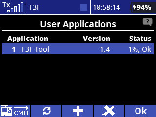
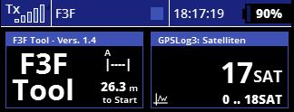
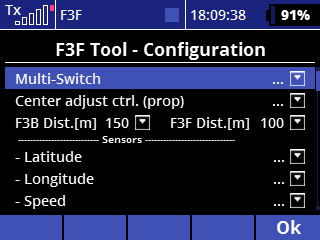
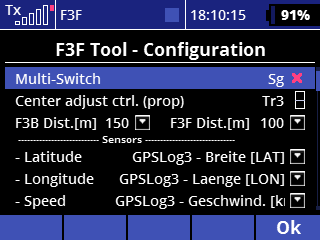
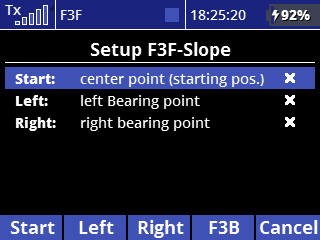
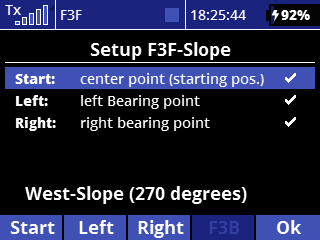
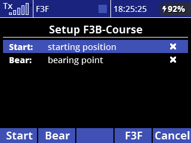
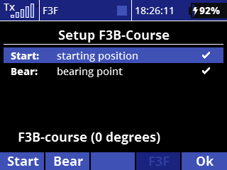

# F3F-Tool Version 1.4 / Installation guide and users manual
### This manual describes how to install, configure and use the F3F-Tool for training of F3F and F3B tasks.  
## Contents:
1. [General Description](#generalDescription)
2. [Program Installation](#programInstallation)
3. [Program Configuration](#programConfiguration)
4. [Usage](#usage)
5. [Pricing and License](#pricing)
6. [Changelog for Users of 1.3 Test Version](#changelog)  

# 1. General Description
## 1.1. What it does
This LUA-App for Jeti transmitters is made for training of slope racing competitions (F3F). Via GPS Sensor the turn lines are identified and an acoustic signal is given. Also the whole run is supported, starting with the countdown, the count of the 10 legs and time measurement.

There is also a mode for F3B available, where in case of speed task the time for 4 legs is measured, in case of distance task only legs are counted.

To use this app a GPS Sensor must be placed in the model and connected to Jeti telemetry.

## 1.2. Known Limitations
- due to GPS tolerance and telemetry latency the turn signal is not 100% precise, but gives a good F3F-experience
- due to some speed related optimization the first fly out must be more than 50m to give the system the possibility
  to calculate the fly in signal accurately, so very short fly out / fly in at 50m is not possible.Depending on the speed of fly out the signal may be given at 60 or even 70 meters.
- somtimes there is a GPS-drift of given start point. In this case the whole course might drift to left or right some meters, because the turn positions are calculated in relation to start. To handle this effect the app includes a function to compensate the drift during the flight.
## 1.3. Requirements
- Newest generation GPS-Sensor must be placed in the glider, needed telemetry values are: **latitude, longitude, speed**
- If the sensor allows, not needed telemetry values should be disabled to speed up the telemetry transfer to transmitter. Also the usage of telemetry values from other sensors or from the receiver should be reduced.
- Please use the newest Firmware for your Jeti-transmitter. This tool was developed and tested with **firmware 5.06 LUA from May 26 2021**, older Versions may cause problems.

Special requirements for 'Generation 1' - transmitters with monochrome display:  
- the newest LUA-enabled firmware must be installed on the transmitter (check: **'System / Info / Version'** – must end with 'LUA')
- **Safety Issue:  
For the model you use with 'f3fTool' no other LUA Application must be installed to consider the given memory limitations!**
##  1.4. F3B Support
To enable this tool also for F3B Training, some features are provided:  
- seperate length definitions for F3F / F3B course
- adapted course-definition for F3B, started from A-Base instead of middle of course
- time measurement after 4 legs in case of a F3B-course used for speed task
- no time measurement, only leg count for distance task
## 1.5. Language support
Currently all menus and display texts are only available in english. All speech announcements are given in english or german,
depending on the system language of the transmitter. For other languages supported by Jeti the audio configuration file must be created similar to 'audio-en.jsn'.

# 2. Program Installation
## 2.1 Copy Files
- Connect transmitter to PC via USB cable
- unpack the zip-Archive **'f3fTool V1.4.zip'** on your computer
- copy the whole contents (file: **'f3f_14.lc'** and directory: **'f3fTool-14'** into the directory 'apps' on your transmitter
- Disconnect transmitter from PC
## 2.2. Activate the tool for a model
The following steps must be done done for every model you want to use with f3fTool:
- Select the model you want to use with the tool on your transmitter
- Select: **'Menu / Applications / User Applications'**
- Press button below **'+'**
- Select file **'f3f_14'** and press **'ok'**  
    -> result is:  **'1 F3F Tool    1.4    xx% Ok'**

    
  _Picture: Installed F3F-Tool_

## 2.3. Configure Telemetry Display
'F3FTool' provides a telemetry window, where the countdown before entering the course, the flown legs and the flight time is shown. To add this window to your display:
- Select **'Menu / Timers/Sensors / Displayed Telemetry'**
- Press button below **'+'**
- open folder **'LUA'** and add **'F3FTool – Vers. 1.4'**
- now you can bring the telemetry windows into the desired order by using the arrow keys.
  
    
  _Picture: F3F-Tool telemetry display, here together  
  with satellite count value from GPS_

# 3. Program Configuration
## 3.1. Basic Configuration
To enter th basic configuration select **'Menu / Applications / F3F Tool - Configuration'**

  
    
  _Picture: Basic Configuration_
  
**Please configure the tool as follows:**
### Multi Switch
This is a switch for different functions:
- start the run with the countdown 
- F3F: toggle A-base
- F3B: toggle speed / distance
- redefine starting point

please use a springloaded switch here

### Center Adjust Control 
This is used for compensation of GPS frift effects. The configuration is optional. 
If you don't need your rudder trim control this can be used to comfortably adjust the course. 
In this case 
- goto 'Menu / Fine Tuning / Digital trim'
- set the rudder trim (Tr3) to '3-pos switch'
- go back to 'F3F-Tool Configuration'
- assign the control ( '+ / Digital Trim / Tr3' )

On DS 24  also the trim controls on the back are useful for this function.
As an alternative the transmitter can be extended by a 2-way springloaded switch, which is available from Jeti. 
**Please configure the control as proportional!**

### F3B Dist.  /  F3F Dist. 
Here you can adjust the length of the course, if needed for some reason.

### Latitude / Longitude / Speed 
Please assign the corresponding values of your GPS sensor here.

##  3.2. F3F Course Setup (Slope)
For calculation of the course the start position (center of the course) and the GPS-bearing of the slope is needed. Therefore the center position and two bearing points (left / right) on the slope must be scanned before first launch. 
The resulting line through the bearing points should be parallel to the slope edge, it is not necessary to scan directly on the edge. It is also not necessary to scan the bearing at the turn positions (50m), but the precision increases with the distance of the two points. 
The start position can be adjusted later by redefinement or readjustment.

The system calculates and shows the wind direction (90° to slope).

_Technical information: 
The slope data is stored in the file 'apps/f3fTool-14/slopeData.jsn'. Once scanned the slope is available to all models stored in the transmitter until it is overwritten._

To setup your slope for F3F: 
- select **'Menu / Applications / F3F Tool – Course Setup'**
- if the current course is a F3B-course, press buton below **'F3F'** to toggle mode
- go with model and activated GPS (must be ready and have found its satellites !) to the three described points
- on every point press the regarding key **(Start / Left / Right)**
- When all points are scanned the Slope direction is shown in the display
- press **'Ok'**

  
_Picture: Slope setup before and after scanning the points.  '270 degrees' means, the slope orientation is exactly west._

##  3.3. F3B Course Setup
Setup for a F3B Course is slightly different. To avoid running into the middle of the course the setup can be done from A-Base. Only the starting position (A-Base) and a secont point in direction of the course are scanned. Precision increases again with the distance of the two points.

To setup your F3B-Course: 
- select **'Menu / Applications / F3F Tool – Course Setup'**
- press **'F3B'** to switch to the needed setup menu (if the current course is a F3B-course it will be preselected)
- go with model and activated GPS (must be ready and have found its satellites !) to the described points
- on every point press the regarding key **(Start / Bear)**
- When both points are scanned the direction of the course is shown in the display
- press **'Ok'**
 

  
_Picture: F3B Course setup before and after scanning the points.  0 degrees' means, that the course points directly to north_

# 4. Usage
## 4.1 Start a run
To start a run just **single click** the defined multi-Switch - the run starts with the 30 sec. countdown (F3F).
In case of a F3B-speed run the countdown will be 60 sec., for F3B-distance there is no countdown.

##  4.2. A-Base support
When a slope is defined, the A-Base is initially on the left side. By doing a **double click** on the defined multi-switch you can toggle the A-base between left and right.
For a F3B-course the A-Base is fix on the start position. 

##  4.3. Drift compensation
Sometimes the whole course may be shifted some meters to left or right by GPS drift effects. If this happens you can compensate this by the defined **'Center adjust control'**
(only if defined, this is optional). So you do not have to land and to rescan the course. 
Every click (or move) of the control to left or right will shift the course 1m. This can be done for example between two training runs, or even – if you like – while beeing in a run.

##  4.4. Redefinement of Start Position
If you have the slope bearing scanned correctly, but want to start from a different position you can redefine the start position by a **'long click'** of the defined multi-switch
what means to hold it pressed for 2 seconds. This is useful to:
- just change position on the slope
- redefine the start position before launch to avoid GPS drift effects.

##  4.5. F3B: choose task
If the current course is a F3B course, **double click** on the multi-switch toggles between speed and distance task.

# 5. Pricing and License
The F3F-Tool software is provided free of costs as open source. It is published under the 'GNU General Public License V3.0' WITHOUT ANY WARRANTY (see: http://www.gnu.org/licenses/). 
So feel free to use it, i hope it is helpful. 
If you like the tool and you are willing to support the project you are welcome to make a donation, i appreciate :)

Link to paypal.me: 
**https://www.PayPal.Me/f3frank**

#  6. Changelog for Users of 1.3 Test Version 
What is new in this Version 1.4?
- Instead of only two points now three points are scanned to define a slope. Also it must be specified, what is left and right.
This allows a greater distance between the left and right point to determine the slope bearing, what means more precision. Also the bearing is independent from the starting point definition.
If you want it to do like in Version 1.3, you can set left or right together with the starting point and then just define the remaining point.
- In F3F mode now the wind direction (90° to slope) is shown instead of direction of the slope edge
- A-Base is supported, can be toggled left /right with the multi switch
- The starting point can be redefined without affecting the slope bearing
- The 'Start Switch' now is a 'Multi Switch' with three functions (start, toggle A-Base left/right, redefine start point)
- The starting point can be adjusted in steps of 1m for compensation of GPS drift effects by a dedicated control
- The speed is now measured and announced 1.5 sec. after course entry instead of directly at course entry
- Countdown announcement now: 30, 25, 20, 15, 10, 9, 8, 7, 6, 5, 4, 3, 2, 1 beep
- F3B Support mode with course definition not from center but from from A-Base, time measurement after 4 legs (speed) or count of legs (distance)
- Currently only english Version available
- Improved error management   

Copyright &copy; 2023 Frank Schreiber
